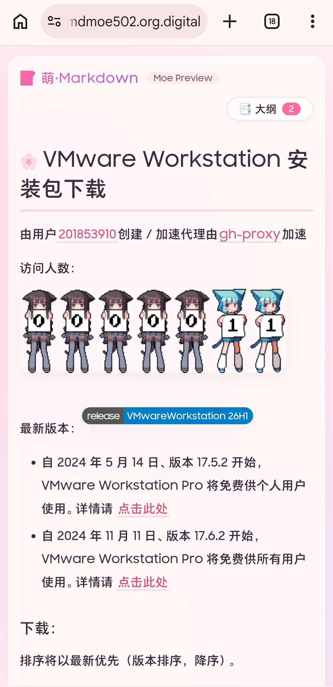

# 🌸 Moe Markdown Viewer

<p align="center">
  
</p>

> 由 AI 生成的 Moe Markdown 查看器 · 萌系主题 · 开箱即用

[](LICENSE)
[](https://pnpm.io)
[](https://gulpjs.com)
[](https://github.com/haoqi75/markdown-viewer-moe/tags)


---

## 🌐 在线演示

打开[https://moe520.haoqi75.os.kg/](https://moe520.haoqi75.os.kg/)即可使用。

---

## ✨ 特色

- 🎀 **萌系主题** – 粉紫渐变、毛玻璃效果、浮动装饰、标题小图标
- 📑 **智能目录** – 自动提取 `h1~h6`，点击平滑滚动，滚动时 URL 自动更新
- 🦘 **锚点导航** – 支持 Markdown `[text](#heading)` 锚点，点击平滑滚动不重载
- 🛣️ **别名路由** – 支持 `?p=test` 形式的参数别名，无需修改服务器配置
- 💕 **萌系错误页** – 加载失败时显示吉祥物 + 大号状态码 + 中文提示
- 🖼️ **图片容错** – 加载失败的图片自动替换为吉祥物占位提示
- 🐱 **GitHub 图标** – 右上角猫咪图标直达仓库，吉祥物 hover 对话泡泡
- ⚙️ **灵活配置** – `config.json` 轻松设置默认文档和别名映射
- 🔧 **开发友好** – 使用 Gulp 构建，支持 `pnpm dev` 实时预览 + 热重载
- 📦 **单文件交付** – 构建后生成 `dist/index.html`，所有资源内联，部署简单
- 💻 **代码高亮** – 集成 Prism.js，代码块美观易读
- 🦊 **萌系吉祥物** – 可配置透明背景的右下角角色，为页面增添活力
- 📝 **自定义页脚** – 支持 Markdown 的页脚内容，轻松添加版权或链接

---

## 📷 预览

| 桌面端 | 移动端 |
|:------:|:------:|
|  |  |

---

## 🚀 快速开始

### 本地部署

#### 前置要求
- Node.js 24+（避免错误，因为这是我开发的Node.js版本）
- pnpm 11.x或者更高（跟Node.js一样）

#### 克隆项目
```bash
git clone https://github.com/haoqi75/markdown-viewer-moe.git
cd markdown-viewer-moe
```

#### 安装依赖
```bash
pnpm install
```

#### 开发模式（自动预览 + 热重载）
```bash
pnpm dev
# 请手动打开 http://localhost:8520
```

#### 生产构建
```bash
pnpm build
# 生成 dist/index.html
```

---

### 自动部署到GitHub Pages

Actions文件在：`.github/workflows/static.yml`

1. **Fork** 和 **⭐Star** 此仓库。
2. 在`Settings`->`Pages`里面找到**Build and deployment**。
3. 在`Source`选项选择`GitHub Actions`。
4. （可选）在`Custom domain`里可以添加你自己的域名。
5. 编辑`src/config.json`，把内容替换成你自己想要的。
6. 转到`Actions`，开启它，在左菜单里找到`Deploy static content to Pages`。
    * 手动触发：点击 **Run Workflow**。
    * 自动触发：每当更改任何文件会自动触发。

祝你一切顺利~

---

## 🌐使用方式

这是一个单独的**html**文件，可以直接打开或者上传到
- GitHub Pages
- Cloudfare Pages
- Netlify
- Vercel
- 任何html服务器

---

## ⚙️ 配置说明

所有配置位于 `src/config.json`：

```json
{
    "title": "🌸 萌·Markdown 预览器：我的专属 Markdown 空间",
    "logo": {
        "text": "📝 萌·Markdown",
        "sub": "我的专属 Markdown 空间"
    },
    "logoImage": "img/favicon.svg",
    "icon": {
        "svg": "img/favicon.svg",
        "ico": "img/favicon.ico",
        "apple": "img/apple-touch-icon.png"
    },
    "footer": "[萌·Markdown](https://github.com/haoqi75/markdown-viewer-moe) | 由 ApHeQua758 与 AI 创建",
    "mascot": "img/mascot.png",
    "defaultUrl": "https://your-default-api.com/raw/index",
    "aliases": {
        "test": "https://another-api.com/raw/wmdownload",
        "docs": "https://docs.example.com/readme.md"
    }
}
```

- **defaultUrl**：当没有匹配别名或 `?md=` 参数时的默认文档地址。
- **aliases**：键为访问路径（如 `?p=vmdownload`），值为实际的 Markdown 文件 URL。

> 访问 `?md=直接URL` 将覆盖所有配置，优先级最高。

---

## 📂 项目结构
```tree
markdown-viewer-moe/
├── .github/
│   └── workflows/
│        └── static.yml     # 自动构建并推送到GitHub Pages
├── images/                  # 图片
├── src/
│   ├── img/                # 图标文件夹
│   ├── index.html          # 主页面
│   ├── style.css           # 萌系样式
│   ├── script.js           # 主要逻辑（TOC、渲染、路由）
│   └── config.json         # 配置文件
├── dist/                   # 构建输出（仅含 index.html）
├── gulpfile.js             # Gulp 构建脚本
├── package.json            # 项目依赖和脚本
├── LICENSE                 # LICENSE
└── README.md               # 就是这个文件啦~
```

---

## 🛠️ 技术栈
- [marked](https://marked.js.org/) – Markdown 解析
- [Prism.js](https://prismjs.com/) – 代码高亮
- [Gulp](https://gulpjs.com/) – 构建工具（内联、压缩）
- [http-server](https://github.com/http-party/http-server) – 开发服务器
- [pnpm](https://pnpm.io/) – 包管理

---

## 🤝 贡献
欢迎提出 Issue 或 Pull Request！
如果您喜欢这个项目，别忘了点个 **⭐Star** 哦～

---

## 📄 License
MIT © [ApHeQua758](https://github.com/haoqi75)

---

## 💖 致谢
本项目由 [AI](https://github.com/) 辅助生成，融合了人类审美与机器效率，愿为您的 Markdown 阅读带来一丝惬意。
