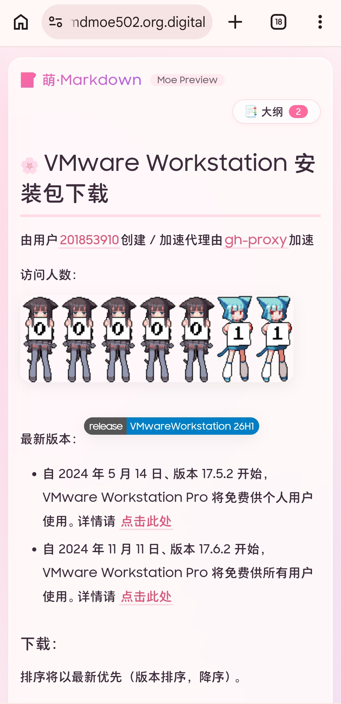
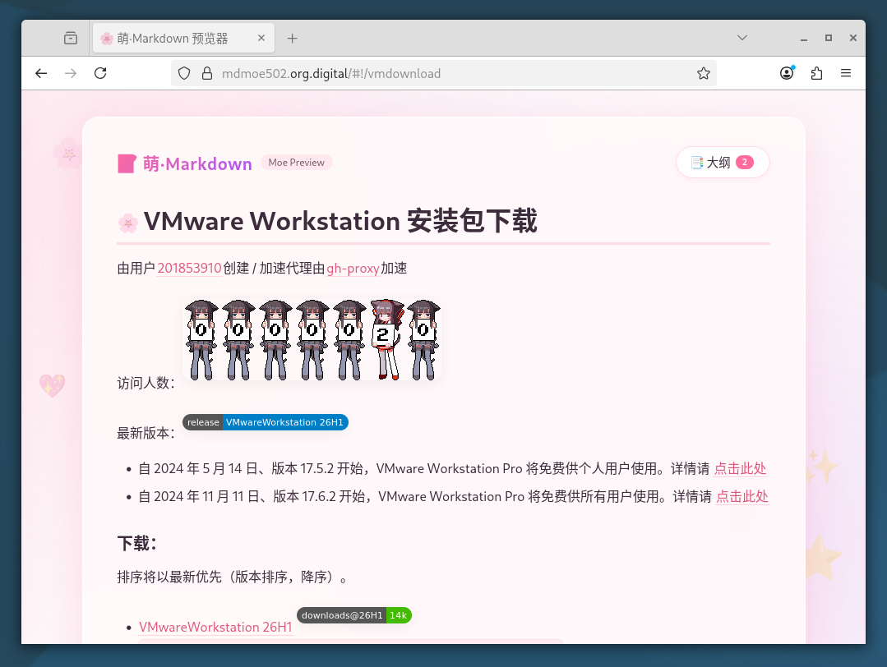

# Moe Markdown Viewer

<p align="center">
  
</p>

> 由 AI 生成的 Moe Markdown 查看器 · 萌系主题 · 开箱即用

<div align="center">

[](LICENSE)
[](https://nodejs.org)
[](https://pnpm.io)
[](https://gulpjs.com)
[](https://moe520.haoqi75.os.kg/)

[](https://github.com/haoqi75/markdown-viewer-moe/tags)
[](https://github.com/haoqi75/markdown-viewer-moe/stargazers)
[](https://github.com/haoqi75/markdown-viewer-moe/releases)
[&labelColor=blue&color=lightpink)](https://github.com/haoqi75/markdown-viewer-moe/forks)

[](https://codeberg.org/haoqi75/markdown-viewer-moe/stars)
[&labelColor=blue&color=pink)](https://codeberg.org/haoqi75/markdown-viewer-moe/forks)

</div>

---

<div align="center">

观看次数：


状态：

[](https://github.com/haoqi75/markdown-viewer-moe/actions/workflows/static.yml)
[](https://github.com/haoqi75/markdown-viewer-moe/actions/workflows/release.yml)

[](https://moe520.haoqi75.os.kg/)
[](https://moe520.haoqi75.cn.mt/)

</div>

此作品基于[AI Markdown](https://github.com/haoqi75/haoqi75)（我的老版首页，已停止更新）生成和修复内容，专门给Moe爱好提供的Markdown预览器。功能增强，修复了老版本错误。

我做了这个作品是为了可以让你们拥有 Markdown 网页预览器。把你的普通 Markdown 页面变成 Moe 好看的页面，纯静态前端、单文件、以及JSON配置文件编辑工具。

> [!NOTE]
> 此作品为 **AI** 生成，部分代码可能会缺失，我毕竟也不知道如何修复有些问题，所以可能全靠 **AI** 修复，谢谢理解。

仓库源码：https://github.com/haoqi75/markdown-viewer-moe

备份仓库源码：https://codeberg.org/haoqi75/markdown-viewer-moe

---

## 🌐 在线演示

打开*以下地址*即可使用。

主地址：https://moe520.haoqi75.os.kg/

备用地址：https://moe520.haoqi75.cn.mt/

---

## 📝 简单编辑 config.json 工具

请打开 [tools.html](https://moe520.haoqi75.os.kg/tools.html) 或者[备用地址](https://moe520.haoqi75.cn.mt/tools.html)来简单编辑。

**v1.9.3**后，点击上面的 `[>]` （Json编辑器）即可打开编辑器。

在Tools版本**v1.7.0**后，配置文件更改了方式，具体在**Tools帮助**查看。

- [Tools帮助](https://moe520.haoqi75.os.kg/?p=tools) 或 [备用](https://moe520.haoqi75.cn.mt/?p=tools)
- [点我直接查看Tools README](tools/README.md)

---

## 📑 目录

- [🌐 在线演示](#在线演示)
- [📝 简单编辑 config.json 工具](#简单编辑-config-json-工具)
- [✨ 特色](#特色)
- [📷 预览](#预览)
- [🚀 快速开始](#快速开始)
- [🌐 如何使用](#如何使用)
- [⚙️ 配置说明](#配置说明)
- [📂 项目结构](#项目结构)
- [🛠️ 技术栈](#技术栈)
- [⭐ Star 历史](#Star-历史)
- [🤝 贡献](#贡献)
- [📄 License](#license)
- [💖 致谢](#致谢)

---

## ✨ 特色

- 🎀 **萌系主题** – 粉紫渐变、毛玻璃效果、浮动装饰、标题小图标
- 📑 **智能目录** – 自动提取 `h1~h6`，点击平滑滚动并自动关闭，滚动时 URL 自动更新
- 🔗 **标题锚点** – h1~h6 左侧显示 🌸🌿🍀💮🌺🌻 可点击跳转图标，桌面 hover 显示
- 🦘 **锚点导航** – 支持 Markdown `[text](#heading)` 锚点，点击平滑滚动不重载
- 🛣️ **别名路由** – 支持 `?p=test` 形式的参数别名，无需修改服务器配置
- 💕 **萌系错误页** – 加载失败时显示吉祥物 + 大号状态码 + 中文提示
- 🐾 **加载动画** – 加载中显示 loading.png 弹跳吉祥物 + spinner
- 🖼️ **图片容错** – 加载失败的图片自动替换为吉祥物占位提示
- 🔍 **图片预览** – 点击图片毛玻璃遮罩放大预览，Esc 关闭
- 🎨 **TOC 装饰** – 侧栏顶部 sit-down 吉祥物 + 可配置对话气泡
- 🐱 **GitHub 图标** – 右上角猫咪图标直达仓库，吉祥物 hover 对话泡泡
- ⚙️ **灵活配置** – `config.json` 轻松设置默认文档和别名映射
- 🔧 **开发友好** – 使用 Gulp 构建，支持 `pnpm dev` 实时预览 + 热重载
- 📦 **单文件交付** – 构建后生成 `dist/index.html`，所有资源内联，部署简单
- 🏷️ **版本号页脚** – 页脚自动显示版本号和 Git 提交 hash，方便追踪部署版本
- 📱 **移动端主题色** – 自动适配浏览器顶部主题色为萌粉色
- 🎨 **颜色主题切换** – 6 种颜色主题（粉/蓝/绿/紫/白/黄），支持配置和 Release 编辑
- 🔗 **专属链接生成** – Tools 内置 Base64 链接生成器，支持多线路网关一键合成
- 🧩 **自定义注入** – 通过 `config.json` 的 `headInject`/`bodyInject` 自由注入 HTML
- 💻 **代码高亮** – 集成 Prism.js，代码块美观易读
- 🦊 **萌系吉祥物** – 可配置透明背景的右下角角色，为页面增添活力
- 📝 **自定义页脚** – 支持 Markdown 的页脚内容，轻松添加版权或链接

---

## 📷 预览

| 桌面端 | 移动端 |
|:------:|:------:|
|  |  |

<details>
  <summary>点击查看更多项目截图</summary>
  
  
</details>

---

## 🚀 快速开始

<p align="left">
  
</p>

### 下载编辑好的

[](https://github.com/haoqi75/markdown-viewer-moe/releases)
[](https://codeberg.org/haoqi75/markdown-viewer-moe/releases)

从**v1.4.0**后，支持直接编辑index.html，从 [Releases](https://github.com/haoqi75/markdown-viewer-moe/releases) （或者[备份仓库Release](https://codeberg.org/haoqi75/markdown-viewer-moe/releases)）下载一个叫`index.release.html`的文件，直接使用记事本编辑上面的内容：
```html
<!--
  ╔══════════════════════════════════════════════╗
  ║  RELEASE CONFIG — 编辑 defaultUrl/aliases/theme/type ║
  ║  修改下方 JSON 后保存，直接部署即可                 ║
  ╚══════════════════════════════════════════════╝
-->
<script id="release-config" type="application/json">
{
  "type": "release",
  "defaultUrl": "https://your-default-api.com/raw/index.md",
  "aliases": {
    "test": "https://another-api.com/raw/rypa",
    "docs": "https://docs.example.com/readme.md"
  },
  "theme": "pink"
}
</script>
<!-- RELEASE CONFIG END -->
<!DOCTYPE html>...
```
编辑后保存，可以重命名为`index.html`，打开或上传到服务器。[更多信息](#使用方式)

从 **tools-v1.2.0** 后，若不会编辑也可以使用[简单编辑 config.json 工具](#简单编辑-config-json-工具)来编辑。

---

### 本地部署

#### 前置要求

- Node.js 24+（避免错误，因为这是我开发的Node.js版本）
- pnpm 11.x或者更高（跟Node.js一样）

#### 克隆项目

```bash
git clone https://github.com/haoqi75/markdown-viewer-moe.git
cd markdown-viewer-moe
```

#### 安装依赖

```bash
pnpm install
```

#### 开发模式（自动预览 + 热重载）

```bash
pnpm dev
# 请手动打开 http://localhost:8520
```

#### 生产构建

```bash
# 全部构建
pnpm run build
# 代码会生成并放在 dist 文件夹里喔~

# 构建软件
pnpm run build:page
# 代码会生成到 dist/index.html 喔~

# 构建Tools
pnpm run build:tools
# 代码会生成到 dist/tools.html 喔~

# 生成404.html (仅部分服务器)
pnpm run build:404
# 代码会生成到 dist/404.html 喔~
```

#### 构建Release版本

```bash
# 全部构建
pnpm run build:release
# 代码会生成并放在 dist 文件夹里喔~

# 构建软件
pnpm run build:page-release
# 代码会生成到 dist/index.release.html 喔~

# 构建Tools
pnpm run build:tools-release
# 代码会生成到 dist/tools-vX.X.X.html 喔~
```

---

### 自动部署到GitHub Pages

Actions文件在：`.github/workflows/static.yml`

1. **Fork** 和 **⭐Star** 此仓库。
2. 在`Settings`->`Pages`里面找到**Build and deployment**。
3. 在`Source`选项选择`GitHub Actions`。
4. （可选）在`Custom domain`里可以添加你自己的域名。
5. 编辑`src/config.json`，把内容替换成你自己想要的。
6. 转到`Actions`，开启它，在左菜单里找到`Build and deploy to Github Pages`。
    * 手动触发：点击 **Run Workflow**。
    * 自动触发：每当更改任何文件会自动触发。

祝你一切顺利~

---

### 自动部署到Codeberg Pages

Actions文件在：`.forgejo/workflows/static.yml`

1. **Fork** 和 **⭐Star** 此仓库。
2. 在`设置`->`仓库功能`->`概览`里面找到**使用Forgejo Actions启用集成CI/CD管道**并开启它。
3. 编辑`src/config.json`，把内容替换成你自己想要的。
4. 编辑`.forgejo/workflows/static.yml`里面的内容
    ```yaml
    // 在40行找到并替换一下代码，其他不要瞎碰碰
    - name: Deploy to Codeberg Pages
        uses: https://codeberg.org/git-pages/action@v2
        with:
          # 上传仅dist文件夹的文件
          source: ./dist
          # 网站域名，有自己的请替换
          site: https://${{ forge.repository_owner }}.codeberg.page/markdown-viewer-moe/
          token: ${{ forge.token }}
    ```
5. （可选）若你想要自定义域名，可以访问官方的文档[自定义域名](https://docs.codeberg.org/codeberg-pages/using-custom-domain/)。
    
    提示，需要在里面加上一行 `server: codeberg.page` 才能自定义域名生效。
6. 转到`Actions`，在左菜单里找到`Build and deploy to Codeberg Pages`。
    * 手动触发：点击 **Run Workflow**。
    * 自动触发：每当更改任何文件会自动触发。

祝你一切顺利~

---

## 🌐 如何使用

> [!WARNING]
> 请确保你的Markdown可以被浏览器访问，Markdown纯文本（Raw），并服务器拥有CORS配置正确，否则无法加载。

### 上传或打开html文件

这是一个单独的**html**文件，可以直接打开或者上传到
- GitHub Pages
- Codeberg Pages
- Cloudflare Pages
- Edgeone Pages
- Google Firebase Hosting
- Netlify
- Vercel
- 任何html服务器

---

### 使用方式

- 方法1：通过编辑 `config.json` 里的 `"defaultUrl"` 和 `"aliases"` （[见下方](#配置说明)）然后重新构建（[见本地部署](#本地部署)）。
- 方法2：下载[Release](#下载编辑好的)文件。按照步骤编辑。
- 方法3：在地址栏提供参数，在地址栏写`?md=<base64 url>`即可访问到Markdown文件。

---

### 地址参数

- `?p=`：别名，在[配置文件](#配置说明)或 [Release](#下载编辑好的) 头部编辑别名，别名编辑好后，可以按照这个方式访问：
  ```url
  http://127.0.0.1:8520/?p=page
  ```
  或者：
  ```url
  https://moe520.haoqi75.os.kg/?p=page
  ```
- `?md=`：加载其他Markdown地址，使用Base64加密地址，按照以下方式访问：
  ```url
  http://127.0.0.1:8520/?md=aHR0cHM6Ly9leGFtcGxlLmNvbS90ZXN0Lm1kCg==
  ```
  或者：
  ```url
  https://moe520.haoqi75.os.kg/?md=aHR0cHM6Ly9leGFtcGxlLmNvbS90ZXN0Lm1kCg==
  ```

>[!TIP]
>加密base64可以使用 `btoa('https://...')` 在浏览器控制台编码。或者在终端输入 `echo "https://..." | base64` 也可以获取base64加密。
>从tools v1.4.0 后可以使用它加密。具体使用访问[tools.html](https://moe520.haoqi75.os.kg/tools.html) 或者[备用地址](https://moe520.haoqi75.cn.mt/tools.html)。

---

## ⚙️ 配置说明

所有配置位于 `src/config.json`：

```json
{
    "type": "normal",
    "title": "🌸 萌·Markdown 预览器：我的专属 Markdown 空间",
    "logo": {
        "text": "📝 萌·Markdown",
        "sub": "我的专属 Markdown 空间"
    },
    "logoImage": "img/favicon.svg",
    "icon": {
        "svg": "img/favicon.svg",
        "ico": "img/favicon.ico",
        "apple": "img/apple-touch-icon.png"
    },
    "footer": "[萌·Markdown](https://github.com/haoqi75/markdown-viewer-moe) | 由 ApHeQua758 与 AI 创建",
    "mascot": "img/mascot.png",
    "defaultUrl": "https://your-default-api.com/raw/index.md",
    "aliases": {
        "test": "https://another-api.com/raw/rypa",
        "docs": "https://docs.example.com/readme.md"
    },
    "tocWelcome": "欢迎来到萌·Markdown",
    "toolsUrl": "./tools.html",
    "headInject": "",
    "bodyInject": "",
    "logoSubUseDocTitle": true,
    "theme": "pink"
}
```

**基本内容**：

- **defaultUrl**：当没有匹配别名或 `?md=` 参数时的默认文档地址。
- **aliases**：键为访问路径（如 `?p=vmdownload`），值为实际的 Markdown 文件 URL。

**高级内容**：

- **title**：标题。
- **logo**：头部文字。
- **logoImage**：头部图标。
- **icon**：网页图标。
- **footer**：页脚内容（支持Markdown格式）。
- **mascot**：可爱吉祥物。
- **tocWelcome**：大纲欢迎词。
- **toolsUrl**：Tools地址，点击上面的 `[>]` （Json编辑器）打开这个地址。
- **headInject**：在 `</head>` 之前注入的自定义 HTML（分析代码、meta 标签等）。
- **bodyInject**：在 `</body>` 之前注入的自定义 HTML（脚本、样式等）。
- **logoSubUseDocTitle**：开启后（默认 true），Logo 副标题自动显示当前文档的 URL 文件名（如 `readme.md`）。关闭则使用 `logo.sub` 固定文本。
- **theme**：颜色主题（默认 `pink`）。可选：`pink`（粉色）、`blue`（浅蓝）、`green`（绿色）、`purple`（紫色）、`white`（淡花白）、`yellow`（黄色）。
- **type**：配置类别标识（`normal` 完整版 / `release` 发布版），供 tools 编辑器识别。

> 访问 `?md=Base64编码的URL` 将覆盖所有配置，优先级最高。

若嫌麻烦可以使用UI化的编辑工具：[tools.html](https://moe520.haoqi75.os.kg/tools.html)

具体在[简单编辑 config.json 工具](#简单编辑-config-json-工具)查看。

---

## 📂 项目结构

```tree
markdown-viewer-moe/
├── .forgejo/
│   └── workflows/
│        ├── release.yml    # 自动发布Release（备份仓库）
│        └── static.yml     # 自动构建并推送到Codeberg Pages
├── .github/
│   └── workflows/
│        ├── release.yml    # 自动发布Release
│        └── static.yml     # 自动构建并推送到GitHub Pages
├── images/                  # 图片
├── scripts/
│   ├── copy-tools.js       # Tools复制准备脚本
│   └── release.js          # Release版本构建代码
├── src/                     # 源代码（里面包含所有内容）
├── dist/                   # 构建输出（包含 index.html、index.release.html、tools.html和tools-vX.X.X.html）
├── tools/                  # 小白也能编辑内容
├── AGENTS.md               # AI Agent提示文件
├── gulpfile.js             # Gulp 构建脚本
├── package.json            # 项目依赖和脚本
├── LICENSE                 # LICENSE
└── README.md               # 就是这个文件啦~
```

---

## 🛠️ 技术栈
- **[marked](https://marked.js.org/)** – Markdown 解析
- **[Prism.js](https://prismjs.com/)** – 代码高亮
- **[Gulp](https://gulpjs.com/)** – 构建工具（内联、压缩）
- **[browser-sync](https://browsersync.io/)** – 开发服务器（热重载）
- **[pnpm](https://pnpm.io/)** – 包管理
- **[npm-run-all2](https://github.com/mysticatea/npm-run-all)** – 编排构建任务

---

## ⭐ Star 历史

<div align="center">
<a href="https://www.star-history.com/?repos=haoqi75%2Fmarkdown-viewer-moe&type=timeline&logscale=&legend=bottom-right">
 <picture>
   <source media="(prefers-color-scheme: dark)" srcset="https://api.star-history.com/chart?repos=haoqi75/markdown-viewer-moe&type=timeline&theme=dark&logscale&legend=bottom-right&sealed_token=3X3PCxJH5Y_CftorWNMDLyeY7hmF3x_EOZ1MNxiydzdoAcWZiRFDykUDeFRn3EQuvZJkJargBZSEtYm72dWJJ3WESDivZ5SnD4FOqV6rKel42lPDC9ztQA" />
   <source media="(prefers-color-scheme: light)" srcset="https://api.star-history.com/chart?repos=haoqi75/markdown-viewer-moe&type=timeline&logscale&legend=bottom-right&sealed_token=3X3PCxJH5Y_CftorWNMDLyeY7hmF3x_EOZ1MNxiydzdoAcWZiRFDykUDeFRn3EQuvZJkJargBZSEtYm72dWJJ3WESDivZ5SnD4FOqV6rKel42lPDC9ztQA" />
   
 </picture>
</a>
</div>

---

## 🤝 贡献

<p align="left">
  
</p>

欢迎提出 Issue 或 Pull Request！
如果您喜欢这个项目，别忘了点个 **⭐Star** 哦～

---

## 📄 License

MIT © [ApHeQua758](https://github.com/haoqi75)

---

## 💖 致谢

本项目由 [AI](https://github.com/) 辅助生成，融合了人类审美与机器效率，愿为您的 Markdown 阅读带来一丝惬意。
